# Showa Retro Theme

Visual Studio Code color themes inspired by the Japanese Showa era aesthetic. Experience nostalgic and warm color palettes that make long coding sessions comfortable and enjoyable.

## Themes

### Nostalgia

#### Nostalgic (Light)
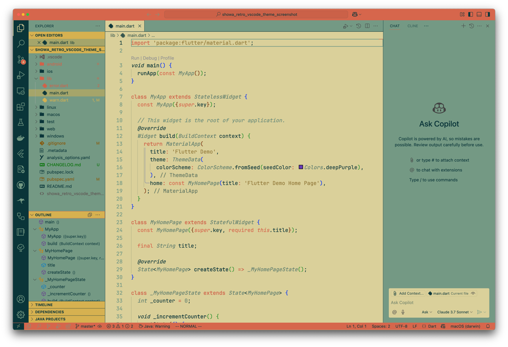

#### Heart (Light)
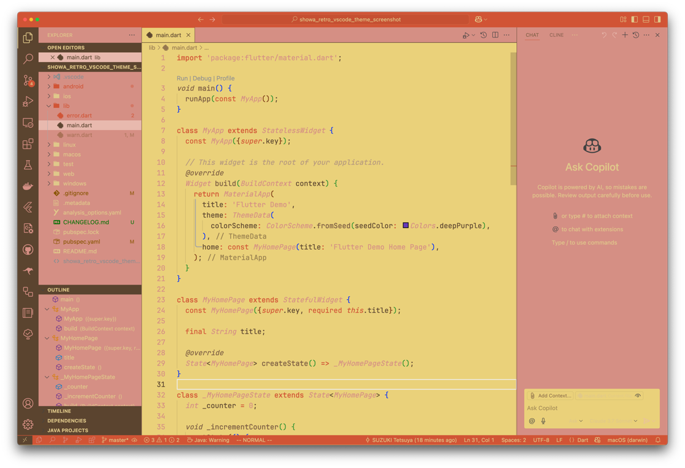

#### Sunset (Light)
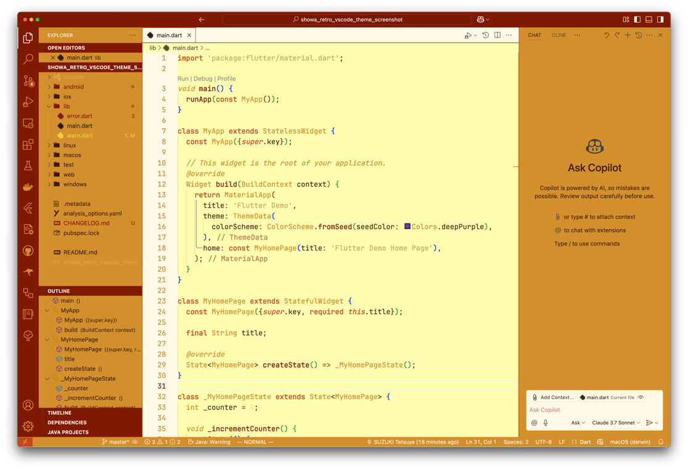

#### Night Downtown (Dark)
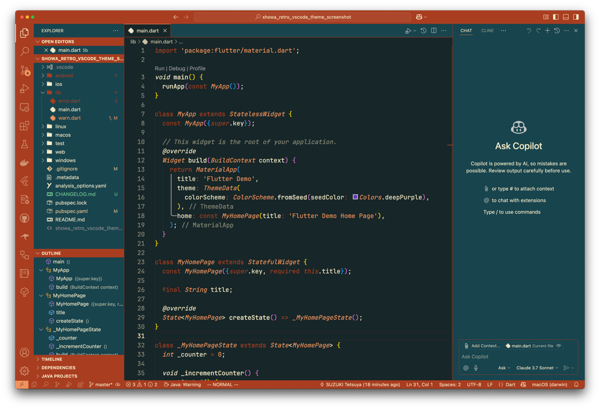

#### Night Festival (Dark)
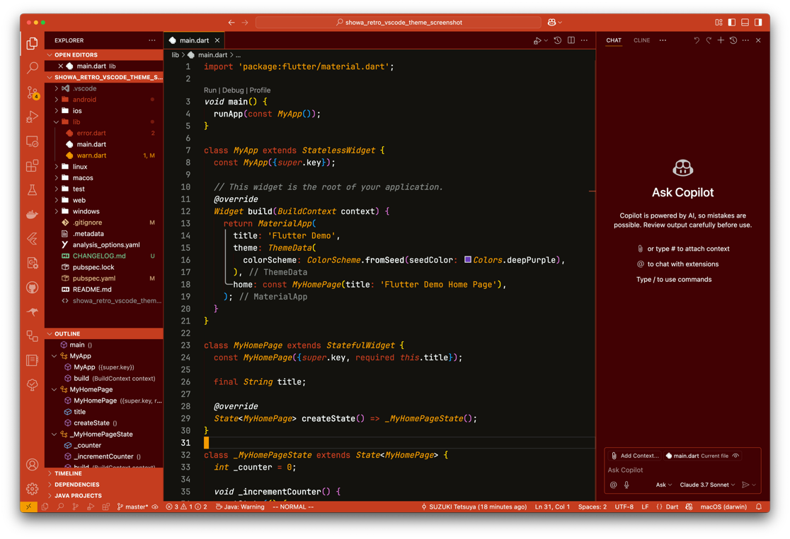

### Food

#### Cream Soda (Light)
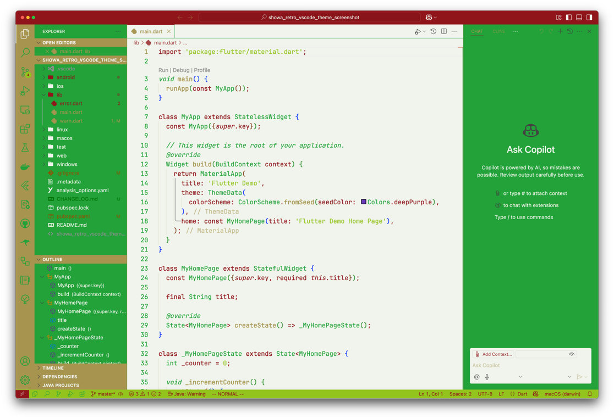

#### Dagashi (Light)
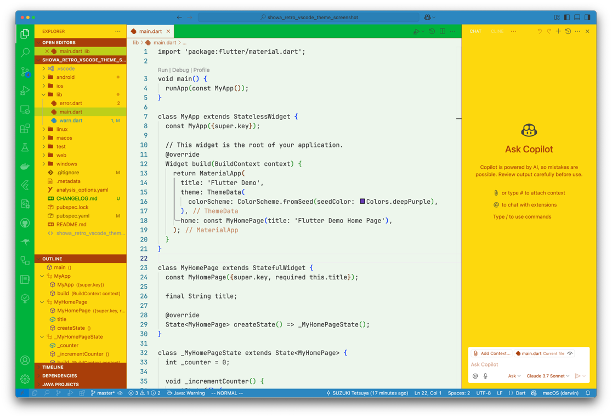

#### Caramel (Light)
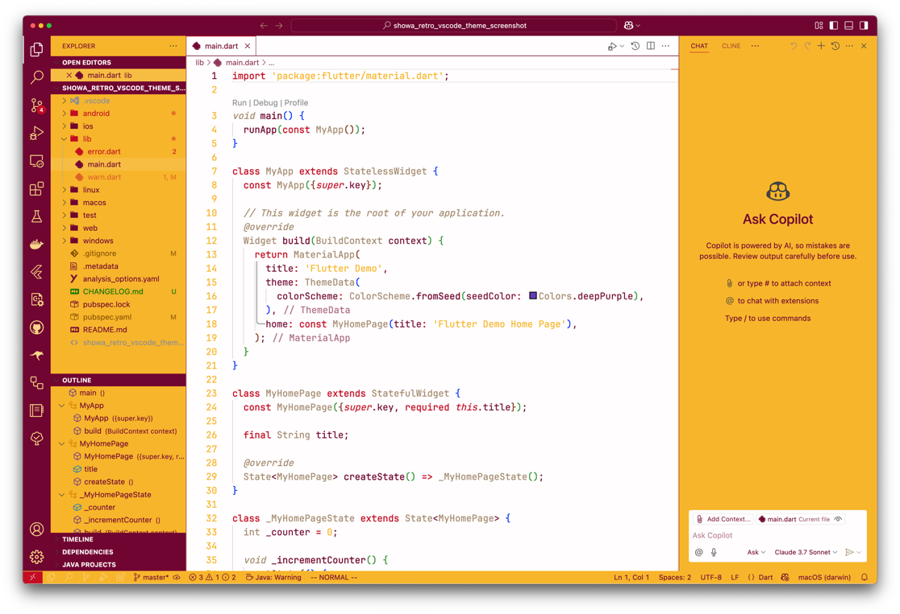

#### Castella (Light)
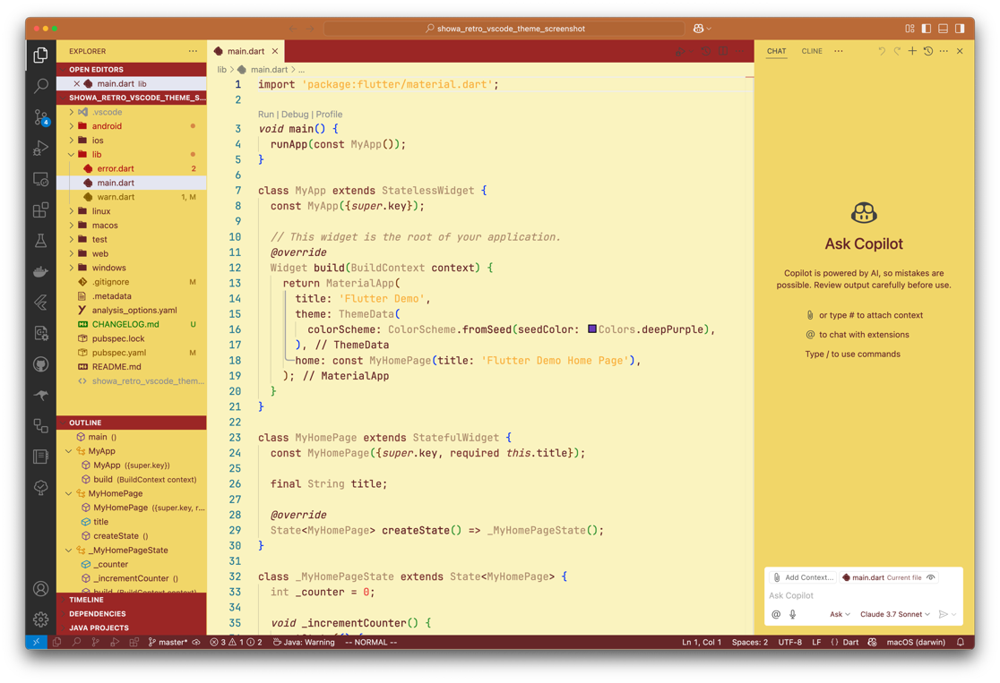

#### Cafe (Light)
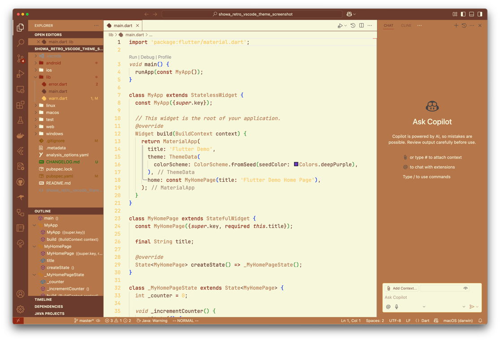

### Spooky

#### Midnight (Dark)
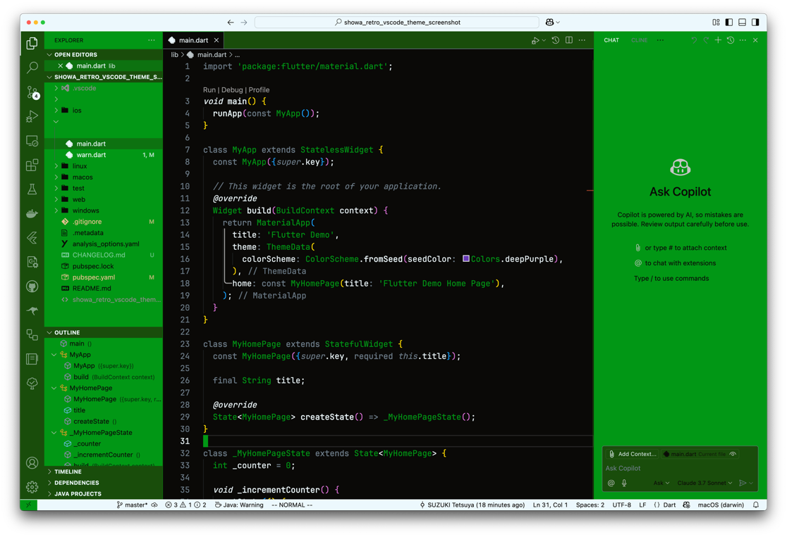

#### Twilight (Dark)
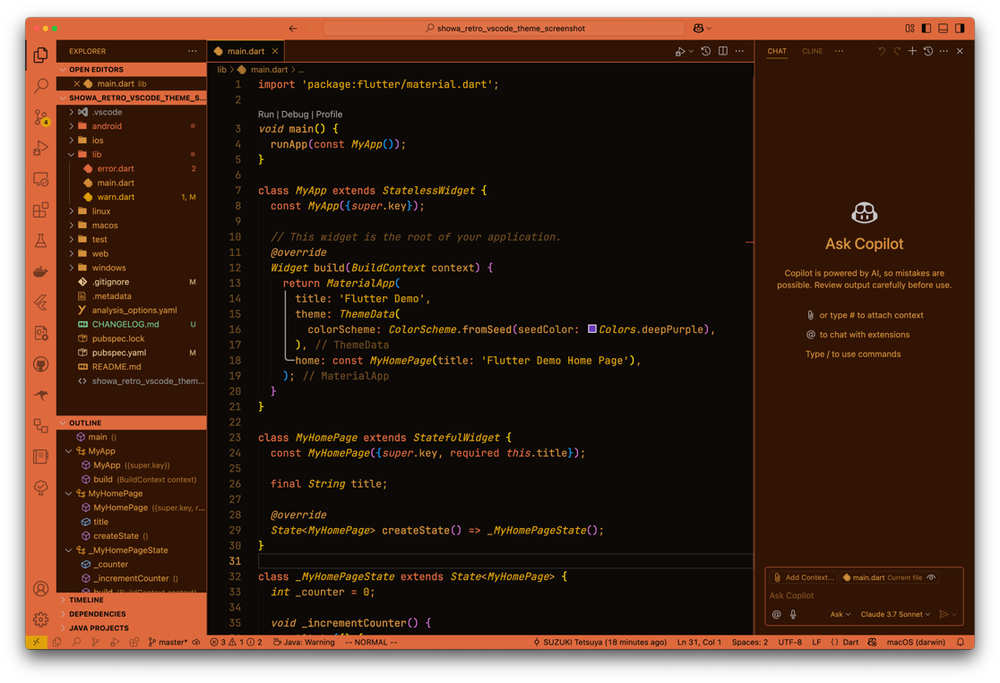

#### Seven Mysteries (Dark)
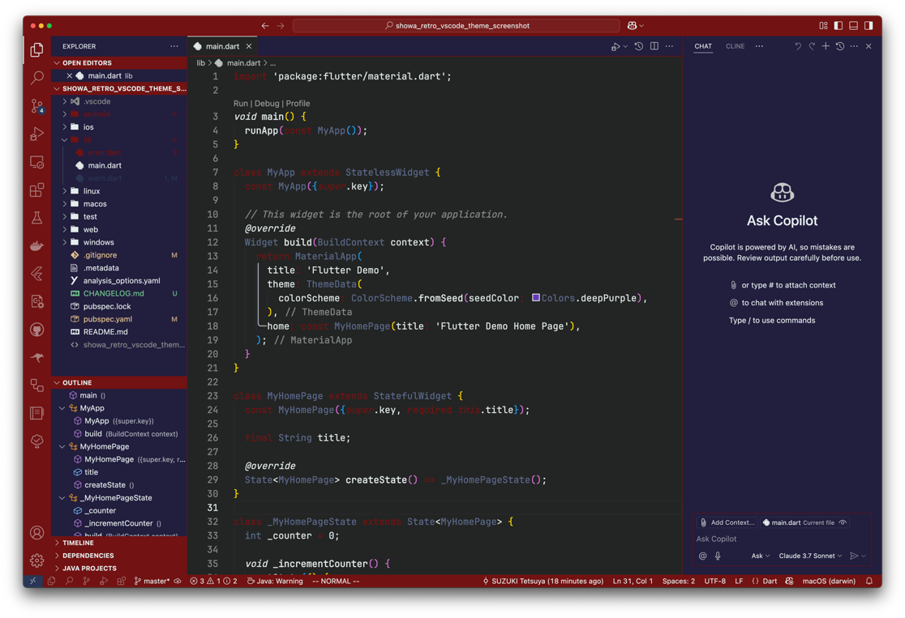

## Installation

1. Open VS Code
2. Click on the Extensions icon in the sidebar (or press `Ctrl+Shift+X` / `Cmd+Shift+X`)
3. Search for "Showa Retro Themes"
4. Click "Install"

Alternatively, you can install it directly from the [VS Code Marketplace](https://marketplace.visualstudio.com/items?itemName=showa-retro-themes).

## Applying Themes

1. Press `Ctrl+K Ctrl+T` (Windows/Linux) or `Cmd+K Cmd+T` (macOS) in VS Code
2. Select a theme that begins with "Showa Retro" from the theme list

Or:

1. Select `File > Preferences > Color Theme`
2. Choose a theme that begins with "Showa Retro"

## Feedback & Contributions

Please report bugs or feature requests on [GitHub Issues](https://github.com/szktty/showa-retro-vscode-theme/issues).

If you enjoy these themes, please consider rating and reviewing them on the [VS Code Marketplace](https://marketplace.visualstudio.com/items?itemName=showa-retro-themes).

## License

[MIT License](LICENSE)

## Developer

SUZUKI Tetsuya
